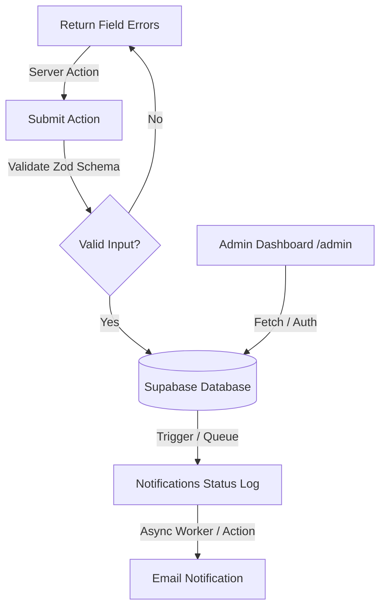

# Implementation Plan: Backend Setup

This plan covers the backend foundation, database configuration, secure submission flow, mobile-first UX improvements, and security hardening for the Marcus Vale Mentorship prototype.

## Current State
- The frontend is built on Next.js (App Router) using Tailwind CSS, Radix UI, Zod, React Hook Form, and Sonner.
- We have merged the `v0/mentorship-application-form-d41b4b06` branch into `main` and resolved conflicts.
- The project currently does not have database or authentication modules configured in `package.json`.
- The application form uses a mock client-only submission handler and success state.

## Target Architecture
We will use **Supabase** for PostgreSQL database, authentication, and Row-Level Security (RLS). Next.js Server Actions will handle secure submissions and dashboard state updates.



---

## User Review Required

> [!IMPORTANT]
> **Missing Contact Information Fields**
> The table structure requested in the prompt and the form in the Vercel branch (`v0/mentorship-application-form-d41b4b06`) do **not** contain `name` or `email` fields.
> - Please confirm if you want us to add `email` and `name` to the database schema and the frontend form so that Marcus has a way to follow up with applicants.
> - *Recommendation:* We should add `email` (string, required, validated) and `name` (string, required) to both the form and the database table.

> [!WARNING]
> **Authentication Setup**
> The private review workflow (`/admin`) will require authentication. We propose using Supabase Auth (email/password) to protect the dashboard and scope queries. The first release can use a seeded admin user account for reviewers.

---

## Open Questions
1. **Should we add `name` and `email` columns to the `applications` table?** (Highly recommended, otherwise submissions are completely anonymous).
2. **Do you have an SMTP provider or Resend API key for the email notifications?** (We will design the email notifications system to write to a status log table first, allowing decoupling and retries).

---

## Proposed Changes

### Database Layer

#### [NEW] `supabase/migrations/20260821000000_create_applications.sql`
- Create the `applications` table with the following schema:
```sql
CREATE TYPE application_status AS ENUM ('new', 'reviewing', 'accepted', 'declined');

CREATE TABLE applications (
  id UUID PRIMARY KEY DEFAULT gen_random_uuid(),
  created_at TIMESTAMP WITH TIME ZONE DEFAULT timezone('utc'::text, now()) NOT NULL,
  experience TEXT NOT NULL,
  market TEXT NOT NULL,
  challenge TEXT NOT NULL,
  process TEXT NOT NULL,
  goal TEXT NOT NULL,
  commitment TEXT NOT NULL,
  status application_status DEFAULT 'new' NOT NULL,
  notes TEXT,
  reviewed_at TIMESTAMP WITH TIME ZONE,
  
  -- Proposed extra fields:
  name TEXT,
  email TEXT
);

-- Indexes for performance
CREATE INDEX idx_applications_created_at ON applications (created_at DESC);
CREATE INDEX idx_applications_status ON applications (status);
```
- Create a `notifications` table to record delivery status separate from form submissions:
```sql
CREATE TABLE notifications (
  id UUID PRIMARY KEY DEFAULT gen_random_uuid(),
  application_id UUID REFERENCES applications(id) ON DELETE CASCADE,
  status TEXT DEFAULT 'pending' NOT NULL, -- pending, sent, failed
  error_message TEXT,
  created_at TIMESTAMP WITH TIME ZONE DEFAULT timezone('utc'::text, now()) NOT NULL,
  sent_at TIMESTAMP WITH TIME ZONE
);
```
- Enable Row-Level Security (RLS):
  - Allow public anonymous `INSERT` (with rate limiting / size limits).
  - Restrict `SELECT`, `UPDATE`, and `DELETE` exclusively to authenticated admin users.

### API & Server Actions

#### [NEW] `lib/supabase.ts`
- Initialize Supabase server client using `@supabase/ssr` or `@supabase/supabase-js`.
- Use a server-only initialization structure (with environment variable validation) to prevent leakages to client components.

#### [NEW] `app/actions/application.ts`
- **`submitApplication(data: unknown)`**:
  - Validates input server-side using Zod.
  - Trims strings and applies length limits (e.g., max 1000 characters for textareas).
  - Prevents duplicates by checking if an application with identical answers was submitted from the same IP address/client within the last 5 minutes.
  - Inserts the application record and creates a pending notification record.
- **`updateApplicationStatus(id: string, status: string, notes?: string)`**:
  - Updates application status and mentor notes. Requires authenticated admin session.
- **`addMentorNote(id: string, notes: string)`**:
  - Adds/edits private notes.

### Frontend Updates

#### [MODIFY] [`components/application-form.tsx`](file:///c:/Users/blues/CODING/marcus-vale-mentorship/components/application-form.tsx)
- Reconstruct the form with the new mobile-first single-column fields.
- Integrate Next.js Server Actions with status loading states.
- Maintain keyboard navigation, inline error state (`aria-invalid`, `aria-describedby`), and first-invalid element focus on failed submit.
- Disable submit button during active submissions.

#### [NEW] `app/admin/page.tsx`
- Private reviewer route displaying submissions sorted newest-first.
- Authenticated reviewers can update statuses, add/edit private mentor notes, and delete submissions with confirmation modals.

### Security and Hardening

#### [MODIFY] [`next.config.mjs`](file:///c:/Users/blues/CODING/marcus-vale-mentorship/next.config.mjs)
- Add security headers (Content Security Policy, X-Frame-Options, X-Content-Type-Options, etc.).
- Add API route size limits and rate limiting via middleware.

---

## Verification Plan

### Automated Verification
- Run `npm run build` and `tsc` to verify compilation and type-safety.

### Manual Verification
- Test visual layout of form and success state at **300×535** mobile responsive size.
- Verify focus behavior and accessibility validation attributes.
- Test rate-limiting and duplicate submission constraints.
- Verify that admin operations are fully protected and confirm before destructive actions.
